# 🎉 Wydarznik - System Organizacji Wydarzeń

Witamy w **Wydarzniku** — intuicyjnej aplikacji internetowej, która umożliwia tworzenie, zarządzanie i uczestniczenie w wydarzeniach w Twojej okolicy.

---

## 📖 Spis treści

- [Opis projektu](#opis-projektu)
- [Funkcjonalności](#funkcjonalności)
- [Zrzuty ekranu](#zrzuty-ekranu)
- [Technologie](#technologie)
- [Instalacja i uruchomienie](#instalacja-i-uruchomienie)
- [Struktura projektu](#struktura-projektu)
- [Plik .env](#plik-env)
- [Dodatkowe funkcje](#dodatkowe-funkcje)
- [Licencja](#licencja)

---

## 🔍 Opis projektu

**Wydarznik** to system wspierający organizację wydarzeń towarzyskich, kulturalnych lub edukacyjnych. Każdy zalogowany użytkownik może tworzyć wydarzenia, zapraszać gości, filtrować eventy oraz do nich dołączać.

---

## 🌐 Funkcjonalności

- ✅ Rejestracja i logowanie
- ✅ Tworzenie wydarzeń (nazwa, data, lokalizacja, obrazek)
- ✅ Lista gości i dodawanie uczestników
- ✅ Edycja i usuwanie wydarzeń
- ✅ Filtrowanie po mieście, dacie i weekendach
- ✅ Sugestie wydarzeń: Warszawa, Kraków, Wrocław
- ✅ Tryb ciemny (Dark Mode)
- ✅ Interfejs responsywny i przyjazny użytkownikowi

---

## 📷 Zrzuty ekranu

### 🏠 Strona główna
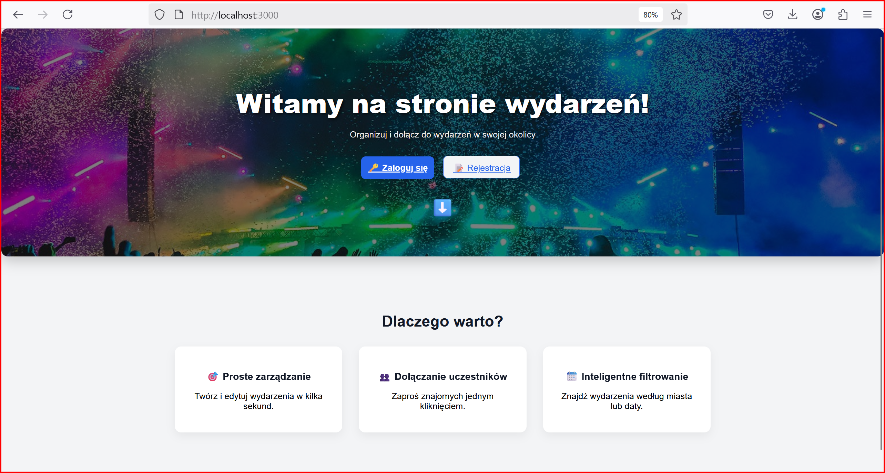

### 🔐 Strona logowania
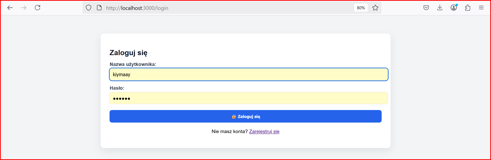

### 📝 Rejestracja
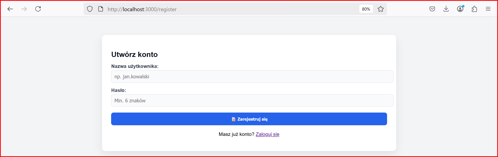

### 🧾 Lista wydarzeń
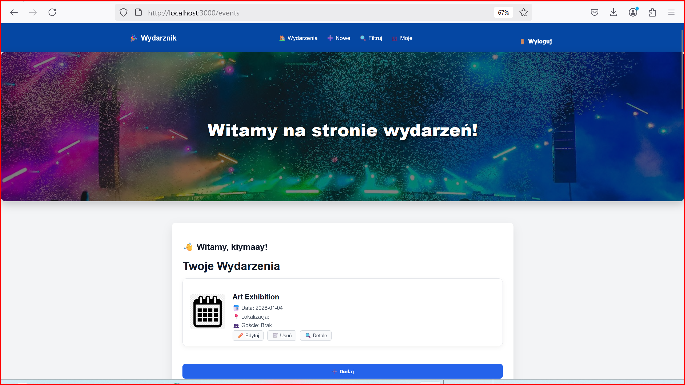

### ➕ Tworzenie / Edycja wydarzeń
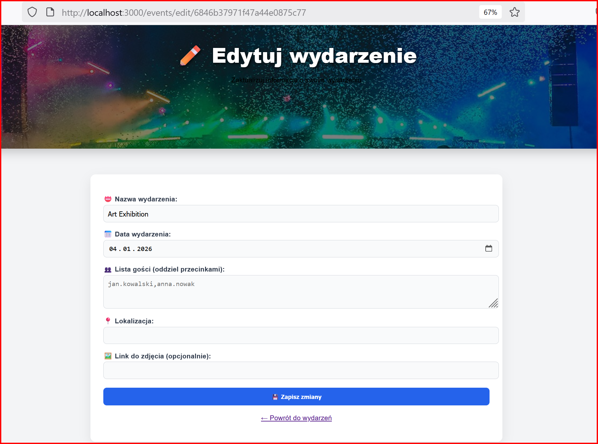

### 🔍 Filtrowanie wydarzeń
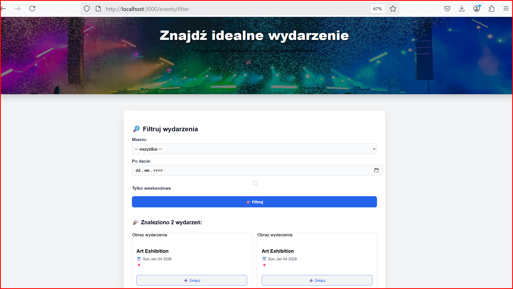

### 🌙 Tryb ciemny
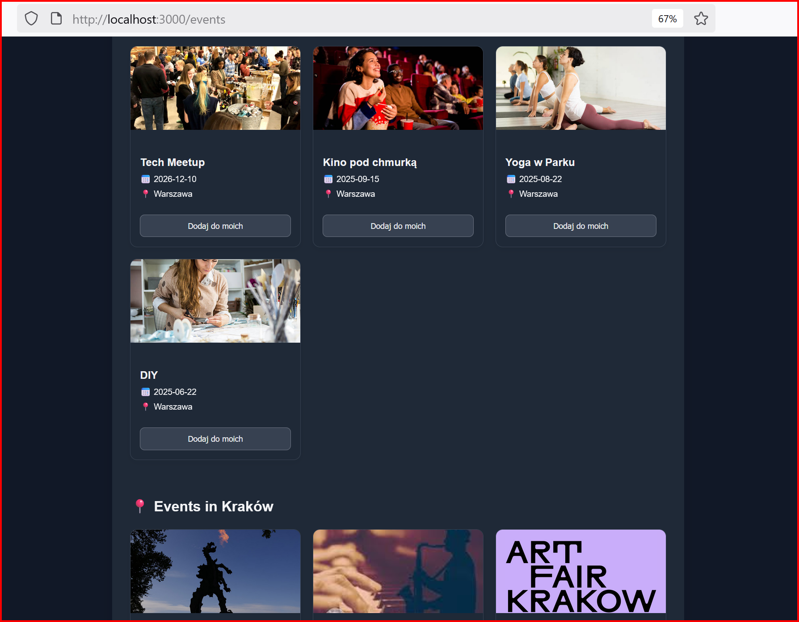

### 📋 Szczegóły wydarzenia


### 📆 Moje wydarzenia
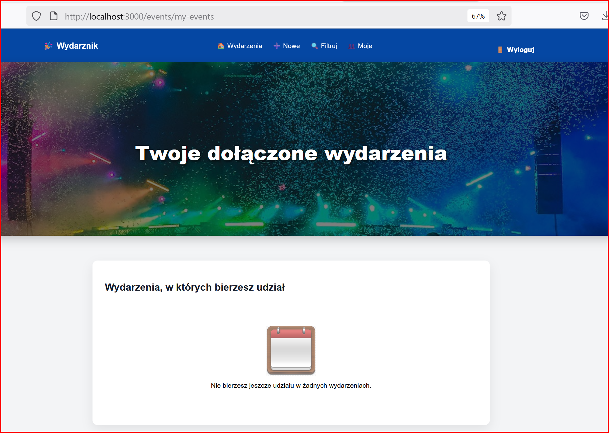

---

## 🗺️ Wydarzenia według miast

### 📍 Kraków
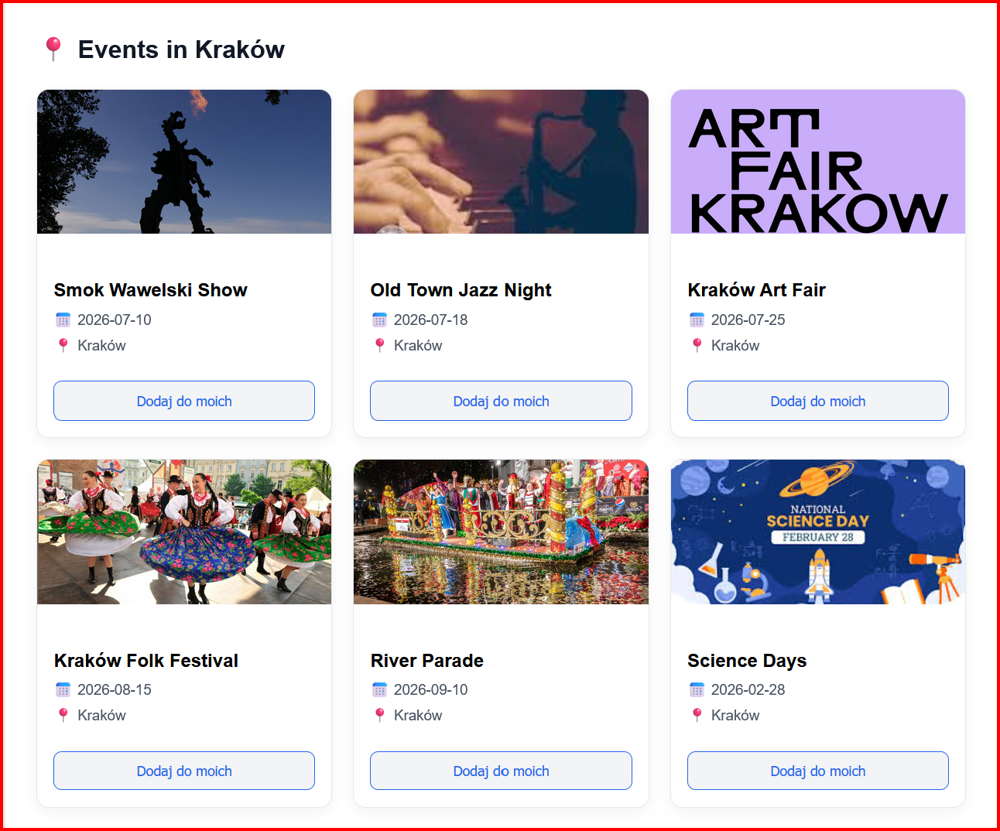

### 📍 Wrocław
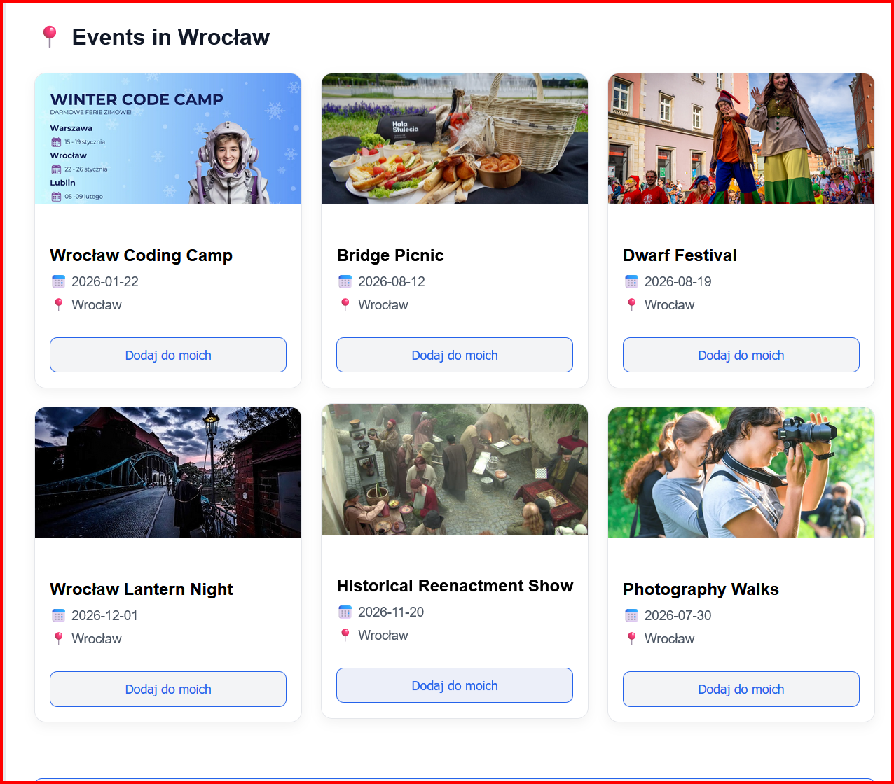

### 📍 Warszawa
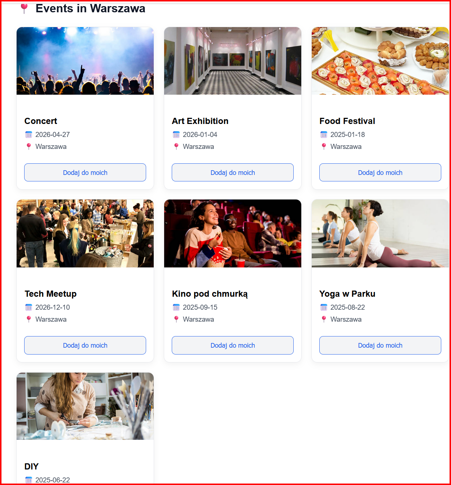

---

## 🤖 Technologie

- Node.js + Express
- MongoDB + Mongoose
- EJS (serwerowe szablony)
- CSS (ręczne stylowanie)
- Express-session (sesje)
- Helmet (zabezpieczenia HTTP)
- Dotenv (zmienne środowiskowe)

---

## ⚙️ Instalacja i uruchomienie

1. **Klonuj repozytorium**:
    ```bash
    git clone https://github.com/twoj-login/wydarznik.git
    cd wydarznik
    ```

2. **Zainstaluj zależności**:
    ```bash
    npm install
    ```

3. **Skonfiguruj MongoDB** (lokalnie lub MongoDB Atlas)

4. **Utwórz plik `.env`**:
    ```env
    PORT=3000
    MONGO_URI=mongodb://localhost:27017/wydarznik
    SESSION_SECRET=jakisSekretnyKod
    ```

5. **Uruchom aplikację**:
    ```bash
    npm start
    ```

➡️ Aplikacja dostępna będzie pod adresem:  
**http://localhost:3000**

---

## 📁 Struktura projektu
controllers/        # logika autoryzacji i wydarzeń  
models/             # schematy Mongoose  
routes/             # routing  
views/              # szablony EJS  
public/css/         # style  
public/images/      # obrazy  
.env                # konfiguracja środowiska  
app.js              # główny plik aplikacji  

---

## 📝 Plik `.env`

Przykład:

```env
PORT=3000
MONGO_URI=mongodb://localhost:27017/wydarznik
SESSION_SECRET=jakisSekretnyKod  # tajny klucz sesji


